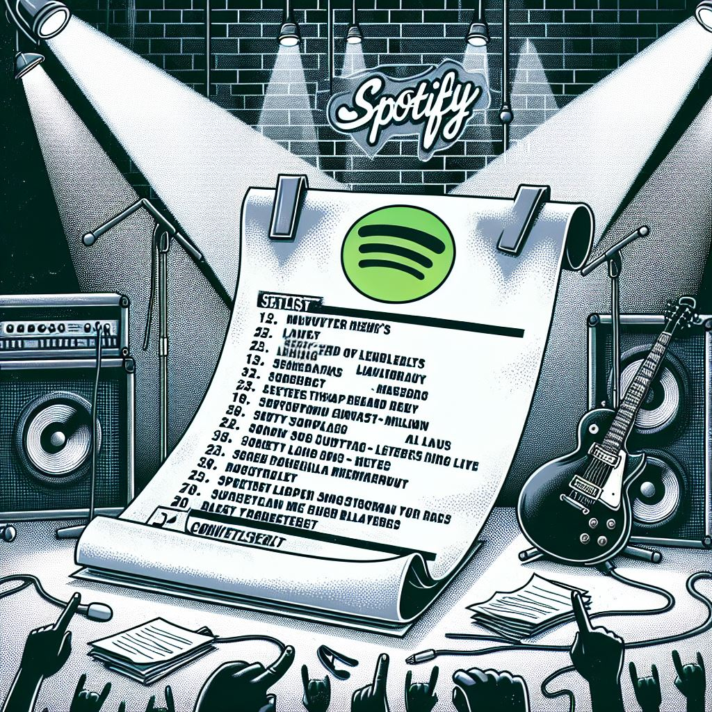

# Playlist-2-Setlist

**Playlist-2-Setlist** is a tool that converts a Spotify playlist into a PDF setlist, which can be printed and brought on stage. This is particularly useful for musicians and bands who want to have a physical copy of their setlist during performances.

## Features

- **Spotify Integration**: Fetches playlist data directly from Spotify.
- **PDF Generation**: Converts playlist data into a formatted PDF setlist.
- **Customizable Layout**: Allows customization of the setlist layout and design.

## Prerequisites

- Node.js
- npm
- Spotify Developer Account

## Installation

1. Clone the repository:
   ```sh
   git clone https://github.com/yourusername/playlist-2-setlist.git
   cd playlist-2-setlist
   ```

2. Install dependencies:
   ```sh
   npm install
   ```

3. Create a `.env` file in the root directory and add your Spotify API credentials:
   ```
   SPOTIFY_CLIENT_ID=your_spotify_client_id
   SPOTIFY_CLIENT_SECRET=your_spotify_client_secret
   ```

## Usage

1. Start the application:
   ```sh
   npm start
   ```

2. Open your browser and navigate to `http://localhost:3000`.

3. Authenticate with your Spotify account and select the playlist you want to convert.

4. Customize the setlist layout if needed.

5. Click the "Generate PDF" button to create and download your setlist.

## Contributing

1. Fork the repository.
2. Create a new branch (`git checkout -b feature-branch`).
3. Make your changes.
4. Commit your changes (`git commit -m 'Add some feature'`).
5. Push to the branch (`git push origin feature-branch`).
6. Open a pull request.

## License

This project is licensed under the MIT License. See the `LICENSE` file for details.

## Acknowledgements

- [Spotify Web API](https://developer.spotify.com/documentation/web-api/)
- [PDFKit](https://pdfkit.org/)

## Contact

For any inquiries, please contact [your-email@example.com].
